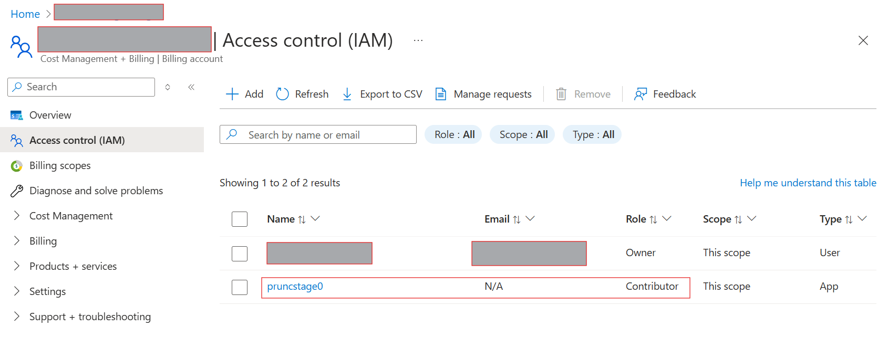
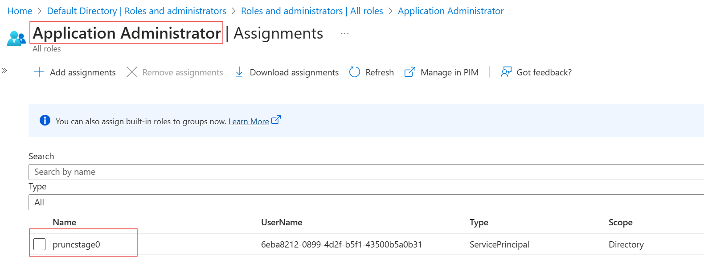
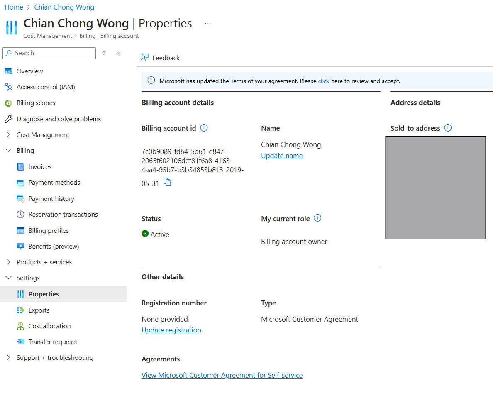
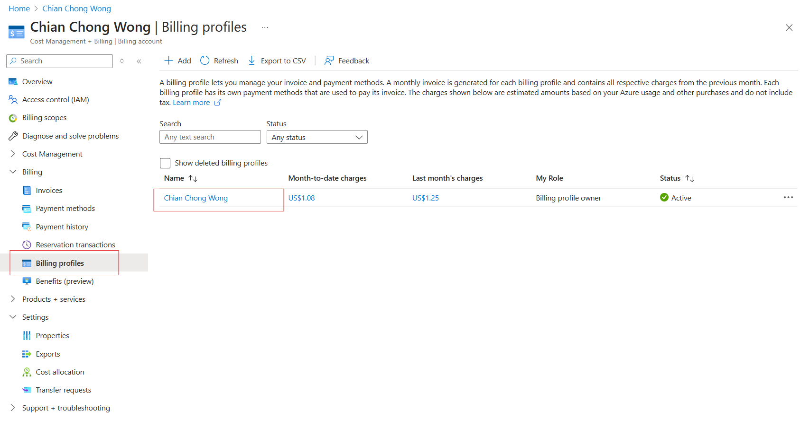
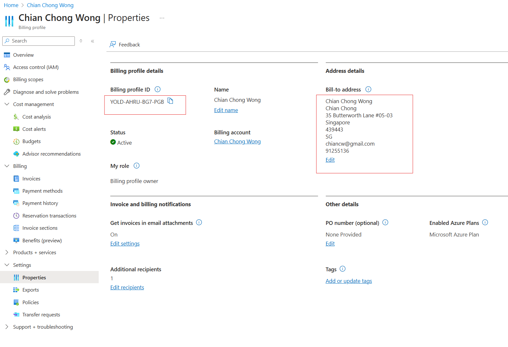
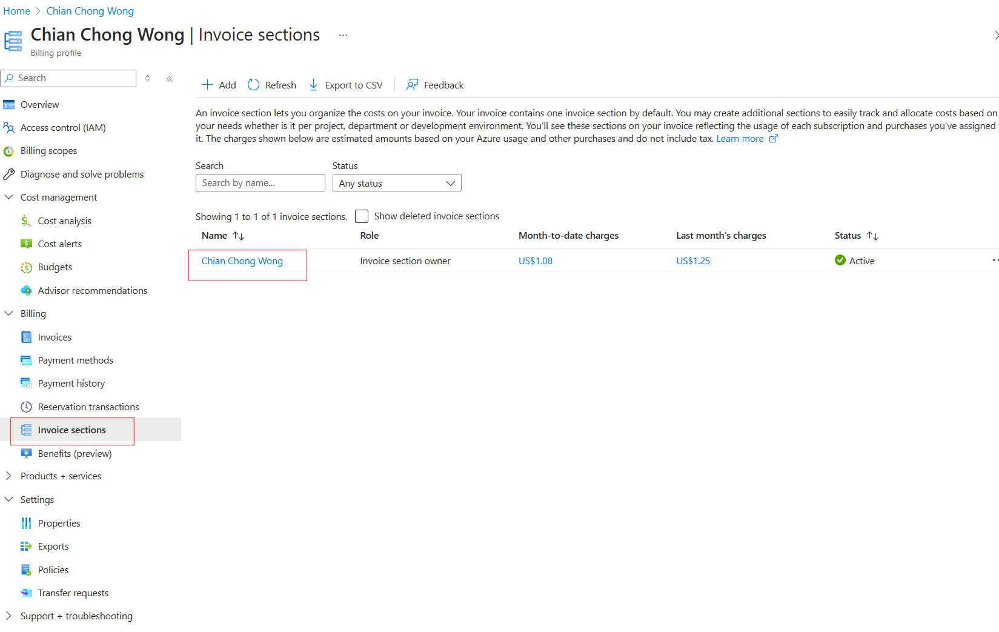
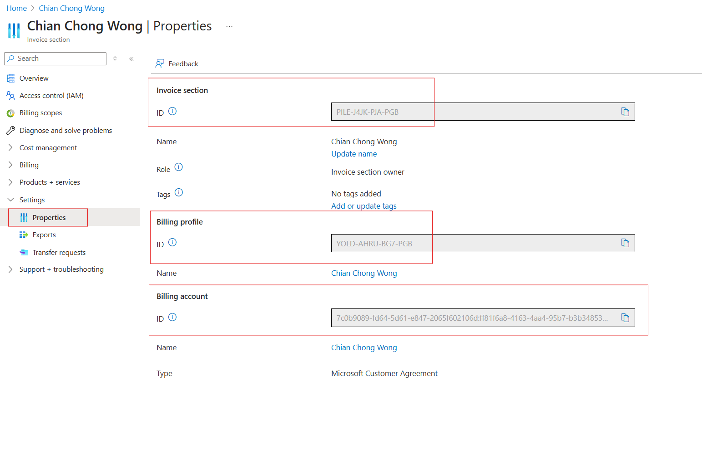

## Stage 0 initial bootstrap
This is the initial bootstrap stage for MCA account. **It has to be adjusted for EA**:

**Pre-requisites**
1. Initial subscription with a storage account and container. The storage account container will contain the tfstate for:
    - management subscription
    - storage account for ESLZ
    - service principal B(ESLZ) and C(subscription vending)

2. Github with Entra Workload ID Federation using a Service Principal A that has required permissions to create MCA subscription, storage account, additional service principals with role assignments. 

3. Existing Github repository for ESLZ with an enviroment called "eslz". 

4. Existing Github app with permissions to ESLZ repository that can be used by Terraform to authenticate to GH and update environment secrets. See https://solideogloria.tech/terraform/authenticating-terraform-with-a-github-app/ and https://registry.terraform.io/providers/integrations/github/latest/docs#github-app-installation for details

For MCA, the service principal used for Github Workload ID federation should have **Contributor** permissions on the billing scope to be able to create subscriptions for MCA

The service principal should also have **Application Administrator** permissions to create service principals and assign roles to them

---

**stage0a - using Terraform with existing service principal A with required permissions**

1. create an EA subscription for management and for connectivity - https://registry.terraform.io/providers/hashicorp/azurerm/latest/docs/resources/subscription and https://learn.microsoft.com/en-us/azure/cost-management-billing/manage/create-enterprise-subscription#create-an-ea-subscription . For permissions to create subscriptions for MCA - https://learn.microsoft.com/en-us/azure/cost-management-billing/manage/create-subscription#permission-required-to-create-azure-subscriptions 

---

**stage0b - create storage account to store ESLZ tfstate**

2. create a storage account and optional app config for ESLZ tfstate in the management subscription

---

**stage0c - create additional service principals**

3. create service principal B with permissions to create entire ESLZ

4. add AZURE_CLIENT_ID with service principal B, AZURE_SUBSCRIPTION_ID with connectivity subscription, and AZURE_TENANT_ID as environment secrets to the existing ESLZ repository's environment "eslz"

5. create service principal C with permissions to use subscription vending

---

**Where to find the following information for MCA**

***Billing account name/id***

---

***Billing profile name/id***

---

***Invoice section name/id***

