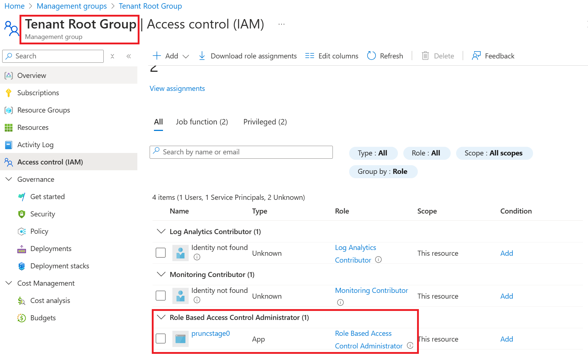
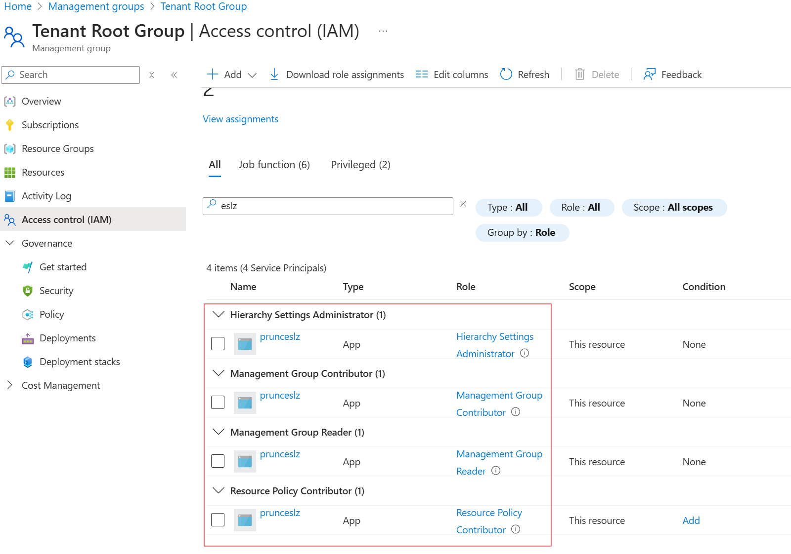
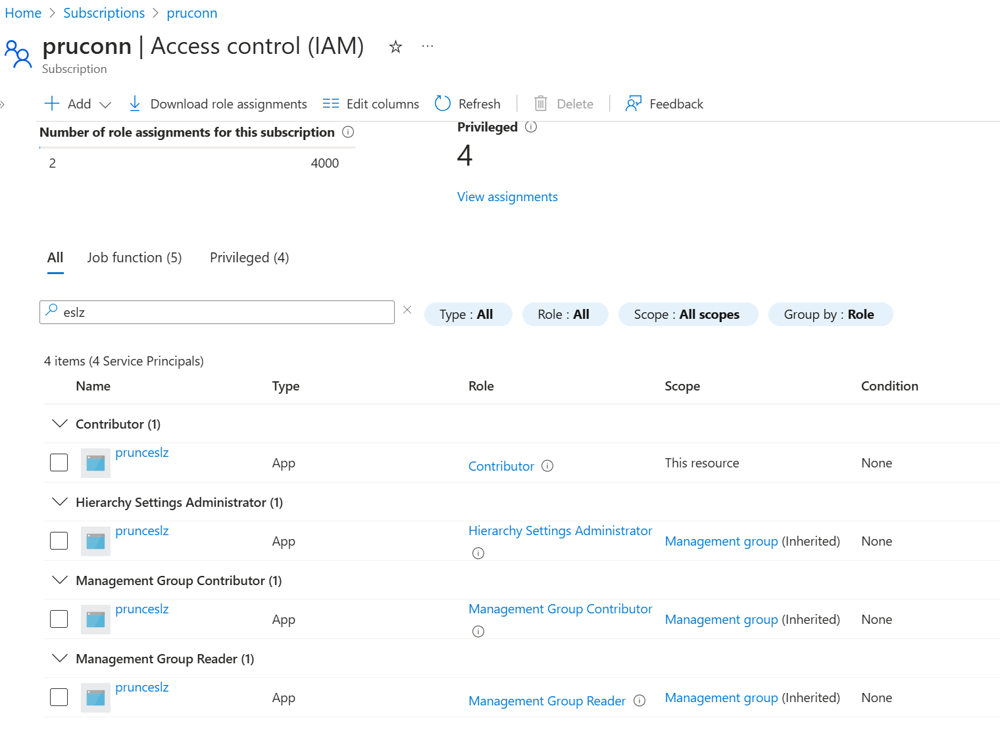
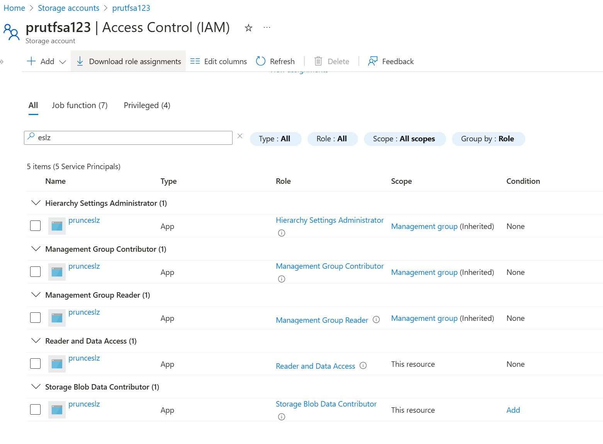

## Stage 0 initial bootstrap
This is the initial bootstrap stage for MCA account. **It has to be adjusted for EA especially in terms of permissions**:

**Pre-requisites**
1. Initial subscription with a storage account and container. The storage account container will contain the tfstate for:
    - management subscription
    - connectivity subscription
    - storage account for ESLZ. Optional app-config(roadmap)
    - service principal B(ESLZ)
    - service principal C(subscription vending, roadmap item)

2. Github with Entra Workload ID Federation using a Service Principal A that has required permissions to create MCA subscription, storage account, additional service principals with role assignments. 

3. Existing Github repository for ESLZ with an enviroment called "eslz", existing Github repository for VWAN with environment called "vwan"

4. Existing Github app with permissions to ESLZ and VWAN repository that can be used by Terraform to authenticate to GH and update environment secrets. See https://solideogloria.tech/terraform/authenticating-terraform-with-a-github-app/ and https://registry.terraform.io/providers/integrations/github/latest/docs#github-app-installation for details

For MCA, the service principal used for Github Workload ID federation should have **Contributor** permissions on the billing scope to be able to create subscriptions for MCA

The service principal should also have **Application Administrator** permissions to create service principals and assign roles to them

The service principal should have **Role Based Access Control Administrator** at tenant root group so as to be able to assign roles to ESLZ service principal created later

---

**stage0a - using Terraform with existing service principal A with required permissions**

1. create a MCA subscription for management and for connectivity. For permissions to create subscriptions for MCA - https://learn.microsoft.com/en-us/azure/cost-management-billing/manage/create-subscription#permission-required-to-create-azure-subscriptions . For permissions to create subscription for EA - https://registry.terraform.io/providers/hashicorp/azurerm/latest/docs/resources/subscription and https://learn.microsoft.com/en-us/azure/cost-management-billing/manage/create-enterprise-subscription#create-an-ea-subscription . 

---

**stage0b - create storage account to store ESLZ tfstate**

2. create a storage account for ESLZ tfstate in the management subscription. Optionally create app-config for to share tfstate data across stages instead of allowing access to tfstate directly (roadmap). Service principal A will have permissions to do this since it is the owner of management subscription.

---

**stage0c - create additional service principals**

3. create service principal B with permissions to create entire ESLZ

ESLZ service principal permissions on Tenant Root Group

ESLZ service principal permissions on connectivity subscription

ESLZ service principal permissions on tfstate storage account

4. add AZURE_CLIENT_ID with service principal B, AZURE_SUBSCRIPTION_ID with connectivity subscription, and AZURE_TENANT_ID as environment secrets to the existing ESLZ repository's environment "eslz"

5. create service principal C with permissions to use subscription vending (roadmap)

---

**Where to find the following information for MCA**

***Billing account name/id***

---

***Billing profile name/id***

---

***Invoice section name/id***

