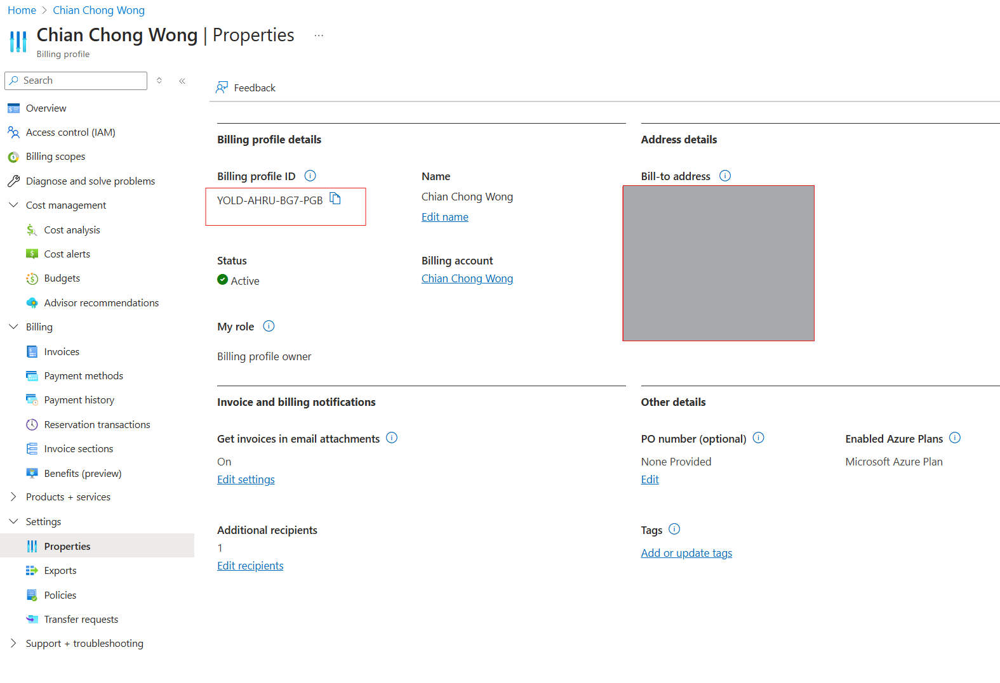
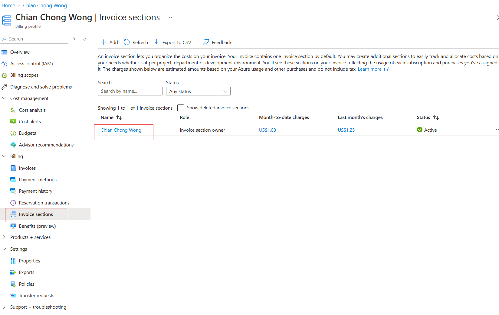

## Stage 0 initial bootstrap
This is the initial bootstrap stage does the following for MCA account. It has to be adjusted for EA:

**Workflow0 - using Terraform with existing service principal A with required permissions**
1. create an EA subscription for management - https://registry.terraform.io/providers/hashicorp/azurerm/latest/docs/resources/subscription and https://learn.microsoft.com/en-us/azure/cost-management-billing/manage/create-enterprise-subscription#create-an-ea-subscription 
2. create a storage account and optional app config for ESLZ tfstate in the management subscription
3. migrate the backend from local to remote tfstate storage 
4. create service principal B with permissions to create entire ESLZ
5. create service principal C with permissions to use subscription vending

---

**Where to find the following information for MCA**

***Billing account name/id***

---

***Billing profile name/id***

---

***Invoice section name/id***

